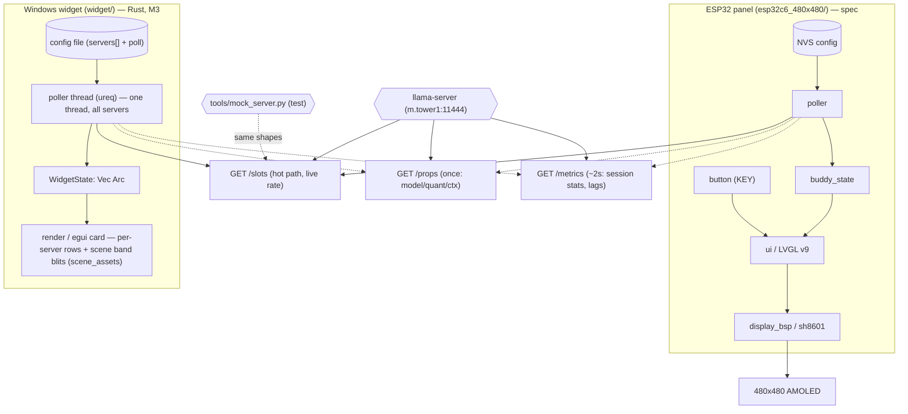

# Architecture

DeskBuddy has the Windows desktop widget (`widget/`, **implemented in Rust,
M3**), the ESP32-C6 AMOLED panel (`esp32c6_480x480/`, **implemented, M1-static
card + scene**), and the ESP32-S3 e-paper panel (`esp32s3_272x792/`, **bring-up:
net-status page + live weather** — not yet on the buddy-state data path). The
widget and the C6 panel are deliberately separate programs sharing one **data
contract**, not one codebase: a poll of `GET /slots` on the host's LAN, the
same `BuddyState` model, the same tok/s derivation, and the same
connection-state taxonomy. The data path is identical end to end; only the
render + I/O layer differs. The widget is **multi-server**: it polls the
servers listed in its config file and shows one row (or scene band) per
server.

Data enters as a plain-HTTP JSON array of llama.cpp slots (`GET /slots`, the
hot path), plus two best-effort secondary sources: `GET /props` (once at
startup per server — model / quant / ctx) and `GET /metrics` (slow background
per server — session stats). Everything is reduced in the pure state layer
(`buddy_state`) to a `Phase` (`Down` / `Idle` / `Prompting` / `Generating`),
the live tok/s, an ETA, and the best-effort model / session context. State
lives entirely in `BuddyState` (one per server, wrapped in `WidgetState`) —
the UI is a function of that struct, so both targets render the same state
identically and neither can get out of sync.

> **Corrected (2026-09-14 live test, reaffirmed M2):** the `/metrics`
> `predicted_tokens_seconds` gauge is **not** a live source. It reads `0.0`
> *while* a slot is generating and only shows the session rate *after* it
> finishes — it **lags**. The **derived** value from `/slots` (Δ `n_decoded`
> / real elapsed) is the **only** live headline path. `/metrics` **is** now
> polled on a slow background pass, but only for a session-average footnote
> and the KV-cache reuse ratio (from the cumulative `prompt_tokens_*`
> counters, which are robust). The mock server reproduces the gauge's lag.

## Components

- **`buddy_state`** — the state machine + tok/s math. Pure logic, I/O
  injected, unit-testable without hardware or a display. The one piece of
  logic both targets reuse. Implemented as `widget/src/buddy_state.rs`
  (`BuddyState` + `ConnState` per server, wrapped in the multi-server
  `WidgetState`). See [modules/buddy-state.md](../widget/modules/buddy-state.md).
- **`poller`** — adaptive multi-server HTTP client. Implemented as
  `widget/src/poller.rs`: an OS thread (not the GUI thread) that `GET /slots`
  for **every configured server** on the adaptive hot path (500 ms working /
  2 s idle / 5 s error, 1500 ms per-request timeout), **fetching all servers
  without the lock first, then applying under one short lock**, plus a
  one-time `GET /props` per server (1000 ms) and a ~2 s background
  `GET /metrics` per server (1000 ms). Feeds each server's `BuddyState`, and
  calls `ctx.request_repaint()`. See [modules/poller.md](../widget/modules/poller.md).
- **`render`** (widget) — `widget/src/main.rs`: an `eframe`/`egui` 0.36
  borderless, transparent, always-on-top window (`BuddyApp`) that clones
  `WidgetState` each frame and paints one row per server (status dot + big
  number, right-aligned model + capacity, leftover line, tok/s sparkline +
  session footnote, dim label/host footer) — or, in scene mode, the
  combined-activity "Plumber's run" bands (blits of `shared/scene-assets/` bitmaps). Window
  height scales with the server count. See [modules/render.md](../widget/modules/render.md).
- **`config`** — implemented: the server list + poll cadence come from the
  JSON config file `%APPDATA%/DeskBuddy/widget.json` (path overridable via
  `DESKBUDDY_CONFIG`); it's written on first run and editable without
  recompile. Device NVS is still planned. See
  [modules/config.md](../widget/modules/config.md).
- **`display_bsp`** (device) — wraps the Waveshare `sh8601` 4-bit panel
  init. *Spec only.* See [modules/display-bsp.md](../esp32c6_480x480/modules/display-bsp.md).
- **`ui`** (device) — LVGL v9 screens: live number, idle, screensaver
  pictures, error glyphs, boot splash. *Spec only.* See [modules/ui.md](../esp32c6_480x480/modules/ui.md).
- **`button`** (device) — KEY debounce + Live ⇄ Screensaver toggle. *Spec
  only.* See [modules/button.md](../esp32c6_480x480/modules/button.md).

## System Diagram

## Data Flow (one poll cycle — widget, as implemented, multi-server)

1. **Poll** — the poller *thread* wakes on the minimum adaptive interval and
   `GET /slots` for **every configured server** (1500 ms timeout each),
   **without holding the lock**. [modules/poller.md](../widget/modules/poller.md)
2. **Parse defensively** — JSON array of slots per server; `next_token` is an
   **array**; `working = any(is_processing)`; `decode_total = Σ n_decoded`
   across slots *and* array entries; first `n_remain`. Any failure ⇒ that
   server's `feed_error()` ⇒ `SERVER_DOWN`, never a crash.
   [shared/API_ENDPOINTS.md](../../shared/API_ENDPOINTS.md)
3. **Reduce** — under **one** `Mutex` lock, `feed_ok(working, decode_total,
    n_remain, n_prompt_tokens, n_ctx, real_elapsed)` per server computes
    tok/s = Δ(decode_total) /
   real Δt and the `Phase` (`Prompting` when `decode_total == 0`). The thread
   sleeps the **minimum** `poll_interval(tuning)` across servers. Separately,
   `feed_props` (once per server) and `feed_metrics` (~2 s per server)
   populate the best-effort model / session fields — they never touch `conn`
   or the rate. [modules/buddy-state.md](../widget/modules/buddy-state.md)
4. **Render on change** — the poller calls `ctx.request_repaint()`; the next
   frame clones `WidgetState` and draws **one row per server** (phase headline
   + model line + leftover (`~Ns left · N tok`) + session footnote
   (`avg N · N% cached`)) — or the combined-activity scene bands.

## Key Design Decisions

- **`/slots` is the only live source; `/metrics` lags** — the gauge reads 0
  while generating and the session rate after. It is never the display path
  (probe + dynamic test confirmed 2026-09-14). M2 polls it on a slow pass for
  a footnote + KV-reuse only. The mock reproduces the lag.
- **Prompting is a real phase** — `working && decode_total == 0` (in-flight
  request, prompt still being processed) is distinct from both Idle and
  Generating. It lets the card say "prompting…" instead of a flat "working."
- **The hot path never depends on the slow paths** — a missing or failed
  `/props` or `/metrics` leaves those fields `None`; the card still shows the
  live rate. Only `/slots` failures take the card to `Down`.
- **Real elapsed, not nominal interval** — tok/s uses actual wall-clock Δt
  between polls (measured with `Instant`), so a slow poll doesn't skew the number.
- **Polling on a background thread, not the GUI thread** — network latency
  never blocks the egui event loop; `Arc<Mutex<WidgetState>>` (one
  `BuddyState` per server) is the hand-off, and the thread never holds the
  lock during network I/O; `request_repaint()` is the wake-up. (The device,
  by contrast, is a single FreeRTOS/Arduino loop with no threads.)
- **First working cycle shows `—`, not a number** — no rate until the counter
  has advanced from a non-zero baseline (avoids a bogus spike on the
  idle→working transition and on a fresh request's counter reset).
- **Idle is a state, not an error** — `working=false` (server up) renders
  dimmed and decays tok/s to 0; `Down` (endpoint unreachable) renders
  an error accent. Conflating them is the one UI bug to avoid.
- **`/props` is version-tolerant** — llama.cpp moved fields between releases
  (top-level `n_ctx` → `default_generation_settings.n_ctx`, `name` →
  `model_alias`). `fetch_props` tries the new path then the old, and
  `feed_props` applies only non-empty values.
- **Config default is the LAN address** (`m.tower1`), not `127.0.0.1` —
  the ESP32 cannot reach the host's loopback; the server must bind `0.0.0.0`.
  The widget's server list + cadence come from the config file
  (`%APPDATA%/DeskBuddy/widget.json`, path overridable via `DESKBUDDY_CONFIG`),
  so retargeting is an edit, not a recompile.
- **Device: reuse Waveshare bring-up** — start from the bundled
  `09_LVGL_V9_Test` example; the `sh8601` 4-bit driver in the code is the
  source of truth over the doc's unverified CO5300/QSPI claim.
- **LCD/TF pin conflict is known and deferred** — SD card shares
  DATA0/DATA1/PCLK with the LCD; MVP ships images baked into flash,
  live-swap is post-MVP.
- **Widget is Rust + egui from the start** — chosen for the self-contained
  `.exe` / low footprint; the earlier Python/PySide6 draft was superseded.
