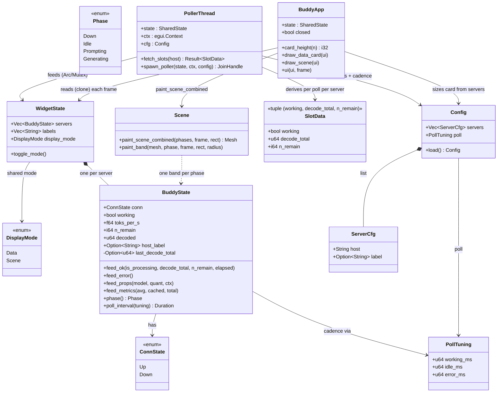

# Class Diagram

Core types. The widget is **implemented in Rust** (`widget/src/`); the device
will mirror the same shape in C (spec only). The widget is **multi-server**:
one `BuddyState` per configured server, wrapped in `WidgetState`.

## Notes

- `BuddyState` is the **per-server** state — the one piece of shared logic the
  device mirrors in C. `WidgetState` is the widget-only wrapper: `Vec<BuddyState>`
  (one per configured server) + labels + a single shared `DisplayMode`.
  `SharedState = Arc<Mutex<WidgetState>>` is the poller↔UI hand-off.
- `PollTuning` holds the config-driven cadence (working/idle/error ms, clamped
  200–10 000). The poller thread sleeps the **minimum** `poll_interval(tuning)`
  across all servers.
- `Config` is the JSON file (`%APPDATA%/DeskBuddy/widget.json`): the
  `servers[]` list (index 0 = top row) + `poll` cadence.
- `ConnState` is two-variant on the desktop: `Up` / `Down`. **Idle is
  `conn == Up && working == false`, not a `ConnState` variant.** The device adds
  `OFFLINE_WIFI` (Wi-Fi down is detected before any HTTP).
- **Threading (widget):** the poller is a real `std::thread`; `WidgetState` is
  shared through `Arc<Mutex<…>>`. The poller **fetches all servers without the
  lock first, then applies under one short lock** and calls
  `ctx.request_repaint()`; the UI reads by locking + cloning each frame. The
  device has no threads — a single FreeRTOS/Arduino loop, so no lock needed.
- `SlotData` is a per-poll value (a tuple), not a runtime object. `n_remain` is
  optional context; `-1` means unbounded. `Scene::paint_scene_combined` is the
  pure band-painter used in scene display mode (one band per server).
